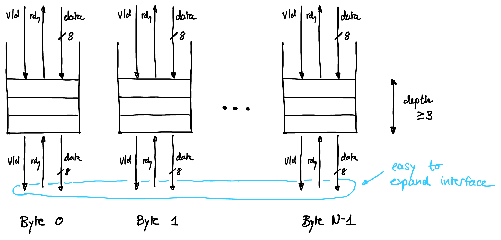

.. _backend:

iDMA Backend
============

The iDMA backend is responsible for generating valid AXI transfers from 1D requests at the :ref:`request interface <Interface>`.
It contains two important modules: 

- :ref:`Legalizer`
- :ref:`Transport Layer`

Parameters
----------

+--------------------------+------------------+---------------------------------------------------+
| Parameter                | Type             | Description                                       |
+==========================+==================+===================================================+
| ``AxiDataWidth``         | ``unsigned int`` | Data width of the AXI bus                         |
+--------------------------+------------------+---------------------------------------------------+
| ``AxiAddrWidth``         | ``unsigned int`` | Address width of the AXI bus                      |
+--------------------------+------------------+---------------------------------------------------+
| ``AxiIdWidth``           | ``unsigned int`` | ID width of the AXI bus                           |
+--------------------------+------------------+---------------------------------------------------+
| ``AxiUserWidth``         | ``unsigned int`` | User bit width of the AXI bus                     |
+--------------------------+------------------+---------------------------------------------------+
| ``1dTransferWidth``      | ``unsigned int`` | Bitwidth supported for transfers (16-64bit)       |
+--------------------------+------------------+---------------------------------------------------+
| ``HardwareLegalization`` | ``bit``          |                                                   |
+--------------------------+------------------+---------------------------------------------------+
| ``SerialModeSupport``    | ``bit``          |                                                   |
+--------------------------+------------------+---------------------------------------------------+
| ``BufferType``           | ``enum``         |                                                   |
+--------------------------+------------------+---------------------------------------------------+
| ``BufferDepth``          | ``unsigned int`` |                                                   |
+--------------------------+------------------+---------------------------------------------------+
| ``ConcurrentAx``         | ``unsigned int`` | Number of concurrent Ax requests in flight (1-32) |
+--------------------------+------------------+---------------------------------------------------+
| ``ErrorHandling``        | ``bit``          | Enable of error handling                          |
+--------------------------+------------------+---------------------------------------------------+

Future features:

- VM: hardware tlb and ptw present (RISC-V, Snitch)
- XOR Engine

.. _Interface:

Interface
---------

The interface to the backend consists of three channels.
All interfaces are *ready-valid* handshaked.

1D request
~~~~~~~~~~

Packed in a ``1d_request_t``: 

+--------------+---------------------------+-----------------------------+
| Field        | Type                      | Description                 |
+==============+===========================+=============================+
| ``length``   | ``logic [tbd:0]``         | length of the transfer      |
+--------------+---------------------------+-----------------------------+
| ``src_addr`` | ``logic [AddrWidth-1:0]`` | source address              |
+--------------+---------------------------+-----------------------------+
| ``dst_addr`` | ``logic [AddrWidth-1:0]`` | destination address         |
+--------------+---------------------------+-----------------------------+
| ``options``  | ``options_t``             | additional transfer options |
+--------------+---------------------------+-----------------------------+

Options in the ``options_t`` packet:

+---------------------+-------------------------+----------------------------------------------------------------------------------------------+
| Field               | Type                    | Description                                                                                  |
+=====================+=========================+==============================================================================================+
| ``axi_id``          | ``logic [IdWidth-1:0]`` | AXI ID to use for transfer                                                                   |
+---------------------+-------------------------+----------------------------------------------------------------------------------------------+
| ``src_options``     | struct                  | Further options for src -> burst type, cache, qor, region, ...                               |
+---------------------+-------------------------+----------------------------------------------------------------------------------------------+
| ``dst_options``     | struct                  | Further options for dst -> ...                                                               |
+---------------------+-------------------------+----------------------------------------------------------------------------------------------+
| ``backend_options`` | struct                  | Further options for backend -> continue_on_error, deburst, decouple, serialize, couple_aw_ar |
+---------------------+-------------------------+----------------------------------------------------------------------------------------------+

DMA response
~~~~~~~~~~~~

+-------------------+---------------------+----------------------------------------------------------+
| Field             | Type                | Description                                              |
+===================+=====================+==========================================================+
| ``error``         | ``logic``           | Error signal (0 is OK, 1 is error)                       |
+-------------------+---------------------+----------------------------------------------------------+
| ``error_payload`` | ``error_payload_t`` | Contains cause and other features TBD for error handling |
+-------------------+---------------------+----------------------------------------------------------+

Error Handler
~~~~~~~~~~~~~

Contains commands for either ``continue``, ``abort``, or ``replay`` -> bit for each or 2-bit selector?

.. _Legalizer:

Legalizer
---------

The legalizer is responsible for interfacing with the midend or frontend and generating valid AXI requests for the :ref:`Transport Layer`, as well as handling errors.

- :doc:`error_handling`

  + FSM
  + Abort -> flush
  + Continue -> w / wo reporting
  + Replay

- Burst Splitting

  + Decouple

    * coalescing
    * asymmetric AW / AR
    * high-performance

  + Deburst
  + Serialize
  + AR-AW-coupling
  + Fixed Burst (/Wrapping Burst?)

- Serialized

  + Deadlock prevention
  + Idle between 1D requests

    * No reordering between successive transfers of different AXI ID
    * Issue: alternating direction

- AR-AW-Coupled

  + Send AW once R is received
  + Prevent congestion
  + Not compatible with high-perf decoupled mode

- Replay on Error

  + Error handling

    * keep sent Ax in fifos

  + In-order transport layer

    * only one transfer is handled at the same time
    * head of fifo is running transfer
    * error response corresponds to Ax at head position

  + Replay is easy in serial mode

    * hust replay Ax in head, reordering of Ax within a 1D transfer is fine

  + Replay is harder in non-serial mode

    * we could have multiple Ax outstanding originating from different 1D trasfers possibly
    * we cannot reorder amongst different 1D tranfers: flush/replay all transfers in fifos
    * better performance during operation, larger penalty in error case

.. _Transport Layer:

Transport Layer
---------------

The transport layer is responsible for the AXI communication, taking AW and AR requests and sending them, handling reads and writes with an intermediate buffer.

- Full AXI4

  + dataflow-oriented
  + realignment
  + coalescing possible
  + always send size = bus size

    * sub-bus access required?

- Buffer is isolated

  + ready/valid handshaking
  + byte granularity

- Read / Write / Buffer: as modules

  + makes replacing them easy
  + add modules in write path

    * compression / encryption / parity / XOR

- User signals:

  + R/W: route them through DMA?
  + AW/AR/B?

