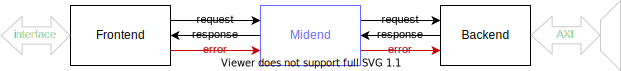

iDMA: An intelligent AXI Direct Memory Access unit
==================================================

An intelligent, configurable & modular DMA based on an AXI memory interface.

Overview
--------
This DMA is split into two groups of modules to combine reusability with a generic programming interface.
The modules of the :doc:`backend <backend>` provide the basics of moving data over an on-chip interconnect.
The modules of the :doc:`frontend <frontend>` implement the programming interface and can be customized depending on the needs of a project.
An optional :doc:`midend <midend>` can be added to allow for translation of N-D requests from the :doc:`frontend <frontend>` to the :ref:`1-D requests <Interface>` accepted by the :doc:`backend <backend>`.

Philosophy / Idea
-----------------

- **clear interfaces**, whenever possible using existing standards
- **modular** -> one hardware fits all
- **adaptable** and **extensible**
- extensively **verified**
- clean code
- minimal hardware

Docs
----

The main documentation of the submodules is divided into the following sections:

.. toctree::
  :maxdepth: 1

  backend.rst
  midend.rst
  frontend.rst
  error_handling.rst
  verification.rst

.. only:: html

  The `Morty docs <morty/index.html>`_ provide the generated description of the SystemVerilog files within this repository.
