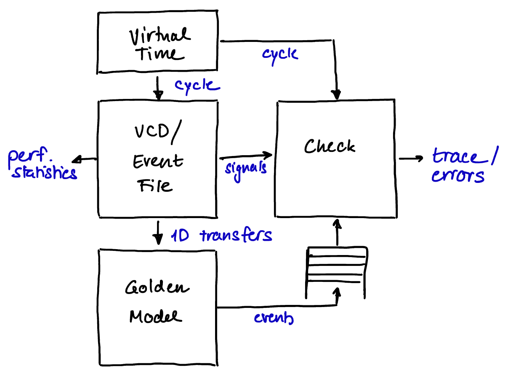

Verification
============

Exhaustive verification of the DMA backend is a necessity to ensure proper functionality and prevent timing glitches.

For verification, two golden models will be used:

- Simple memcpy golden model in CI testbench

  + Catch biggest problems immediately

- Event-based in-depth golden model

  + python-based
  + can be coupled with a tracer
  + file-based interface to simulation

    * works in-system
    * VCD or event file format

.. rst-class:: clear-both

.
